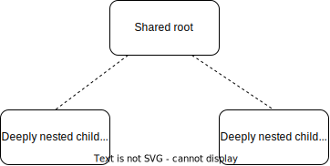

# React Websocket Exploration

## What and Why?

React does not have data fetching built in. Its sole responsibility is rendering UI based on some (both internal and external)
state. In response to this, a big ecosystem of data-fetching systems built for React has proliferated, and entire businesses
have emerged that basically bundle React and routing-based data fetching strategies.

**However, the same cannot be said for websocket data**. None of the popular React metaframeworks (Next, React Router v7) in any way
address the issue of how to connect to a live data source and where to store it in the context of React.

In my personal work experience, we have tried to solve the issue by establishing the websocket connection on the component level. A
generic hook can be provided with a config object that accepts callbacks for the websocket event callbacks (onmessage, onclose, 
onopen). When the component unmounts, the hook closes the websocket connection. While an elegant solution, it does not solve storage 
of the websocket data, and critically, only provides the data to children of this node. In addition, it is a purely React-centric
solution, and does not work cross-framework.

My main issue with this approach is that it either welcomes huge states in the root tree, or multiple websocket connections when multiple branches in the application tree require the same data:



In a situation where children A and B require live data from the same live source, they have two options, either they store the data in the shared root node, which might be several component levels higher, or they both establish the same websocket connection to the data source, introducing loading screens even though the client has already loeaded the data.

Again, none of these solutions are transferable to other frameworks than React.

So in this repository, I've tried to investigate an alternative solution to websocket data fetching in React, that

- only connects to the same data source once
- only connects to a data source if a consumer exists
- is framework-agnostic

## Quickstart

Run `npm install` to install all dependendencies of this project.

`npm run server` starts a simple websocket server at `localhost:8080` that offers data source routes `A`, `B` and `C`. These routes only publish periodically, and notably not at initial connection. They all publish a numerical value between 0 and 1.

`npm run dev` starts a vite dev server running a React frontend. By clicking the `A`, `B` or `C` buttons, a component registers a data requirement to the respective endpoint, and renders the data as it is received. Pressing any of the `X` buttons will unmount the component.

## Technical implementation

This project introduces a `WebsocketManager` which handles all websocket connections and caches data for endpoints as long as a single consumer registers an intent to consume a data source. The Manager is acting as an *Observable* and consumers are *Observers*. This data is injected into React using [`useSyncExternalStore`](https://react.dev/reference/react/useSyncExternalStore), which is wrapped in hook `useWebSocketData.ts`. React no longer stores any websocket data, rather, the `WebsocketManager` is also a very minimal state management implementation.

## Demo

In the demo, you can observe the following:

1. When sections are added, only one websocket connection per data source will be active at any given moment.

> You can verify this behavior in the browser devtools.

2. Initially, the websocket manager returns `{ status: 'INITIAL' }` as data.
> The demo ui will display "no data received yet".

3. As soon as a data source receives data from the server, all consumers are updated immediately.

0. If any component has already received data from the server, adding a new component with the same data source will render data immediately, as it receives a cached version of the data.

0. If all components with the same data source are unmounted, mounting a new component with this data source will again display "no data received yet", as the cache is purged.

0. If all consumers of an endpoint unmount, the WebsocketManager will close the websocket connection.

0. If the server sends unexpected data (such as a string value when expecting a JSON value) the consumers will receive a `{ status: 'UNPARSEABLE' }` message from the WebsocketManager.

## Vite / React / Typescript template documentation

This template provides a minimal setup to get React working in Vite with HMR and some ESLint rules.

Currently, two official plugins are available:

- [@vitejs/plugin-react](https://github.com/vitejs/vite-plugin-react/blob/main/packages/plugin-react/README.md) uses [Babel](https://babeljs.io/) for Fast Refresh
- [@vitejs/plugin-react-swc](https://github.com/vitejs/vite-plugin-react-swc) uses [SWC](https://swc.rs/) for Fast Refresh

## Expanding the ESLint configuration

If you are developing a production application, we recommend updating the configuration to enable type aware lint rules:

- Configure the top-level `parserOptions` property like this:

```js
export default tseslint.config({
  languageOptions: {
    // other options...
    parserOptions: {
      project: ['./tsconfig.node.json', './tsconfig.app.json'],
      tsconfigRootDir: import.meta.dirname,
    },
  },
})
```

- Replace `tseslint.configs.recommended` to `tseslint.configs.recommendedTypeChecked` or `tseslint.configs.strictTypeChecked`
- Optionally add `...tseslint.configs.stylisticTypeChecked`
- Install [eslint-plugin-react](https://github.com/jsx-eslint/eslint-plugin-react) and update the config:

```js
// eslint.config.js
import react from 'eslint-plugin-react'

export default tseslint.config({
  // Set the react version
  settings: { react: { version: '18.3' } },
  plugins: {
    // Add the react plugin
    react,
  },
  rules: {
    // other rules...
    // Enable its recommended rules
    ...react.configs.recommended.rules,
    ...react.configs['jsx-runtime'].rules,
  },
})
```
